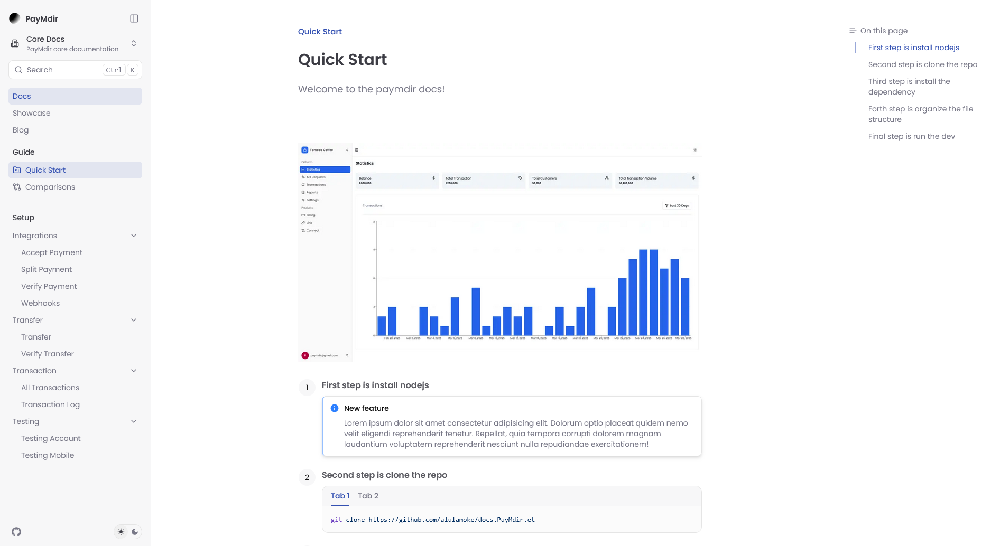

# PayMdir Documentation Portal

This is the official documentation site for PayMdir's payment gateway system, built with [Next.js](https://nextjs.org/) and [Fumadocs](https://fumadocs.vercel.app).



## Overview

The PayMdir Documentation Portal provides comprehensive API documentation, integration guides, and resources to help developers seamlessly connect to PayMdir's powerful payment system. Build, test, and deploy with ease.

## Getting Started

### Prerequisites

- Node.js 18.x or higher
- npm, yarn, or pnpm

### Installation

1. Clone the repository:

```bash
git clone https://github.com/alulamoke/docs.paymdir.com.git
cd docs.paymdir.com
```

Run development server:

```bash
npm run dev
# or
pnpm dev
# or
yarn dev
```

Open http://localhost:3000 with your browser to see the result.

## Learn More

To learn more about Next.js and Fumadocs, take a look at the following
resources:

- [Next.js Documentation](https://nextjs.org/docs) - learn about Next.js
  features and API.
- [Learn Next.js](https://nextjs.org/learn) - an interactive Next.js tutorial.
- [Fumadocs](https://fumadocs.vercel.app) - learn about Fumadocs
